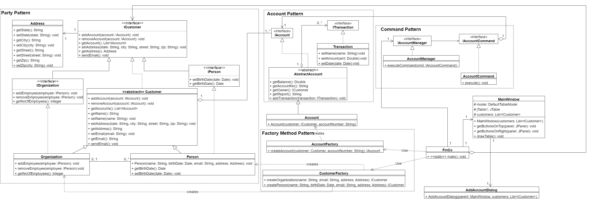

# FinCo
A Financial Company framework for our Advanced Software Development course at Maharishi International University.

# Design
## Class Diagram


## @todo add sequence diagrams
All Diagrams can be found under the docs directory

# Patterns Used
### 1. Party Pattern
The Party Patter is a design pattern used to structure Organizational Hierarchies within a design.

In FinCo framework we use it to define hierarchies between a Person and Organization(Company) units.

### 2. Account Pattern
The Account Pattern is a design pattern used to keep information about an account and all the entries
related to a given account.

In FinCo framework we use it to keep track of an account information along with transactional information.

### 3. Command Pattern
The Command Pattern is a behavioural design pattern used to encapsulate actions and store and trigger them
at a later time.

In FinCo framework we use it to perform actions related to accounts.

### 4. Factory Pattern
The Factory Pattern is a creational design pattern used to create objects.

In FinCo framework we use it to create Account and Customer instances.

# Plug Points in the Framework
* [x] ICustomer: A interface for specifying basic Customer information. Clients can implement it if the need for more customer 
            types arise. Organization and Person Customers already exist in the system.
* [x] AbstractAccount: An abstract class for specifying basic customer related account.
* [x] AccountManager: A class for dispatching commands. Clients can use it as is or override to implement their own logic.
* [x] AccountFactory: A class for creating Accounts. Clients must override it to create their own account objects.
* [x] CustomerFactory: A class for creating Customers. Clients can use it as is or override it if more Customer 
                        types are present in their applications.
* [x] MainWindow: A class for specifying the main layout of the application.
* [x] AddAccountDialog: A class for specifying the Dialog window of adding an account.

# Build
to build use the terminal script `build.sh`
```shell script
chmod +x build.sh # use it only once to give executable permission to the file
./build.sh [bank|ccard]
```
and run with: `java -jar target/bank.jar` or `java -jar target/ccard.jar`

if using windows write the following commands
```shell script
mvn -Pbank clean package
mvn -Pccard clean package
```
